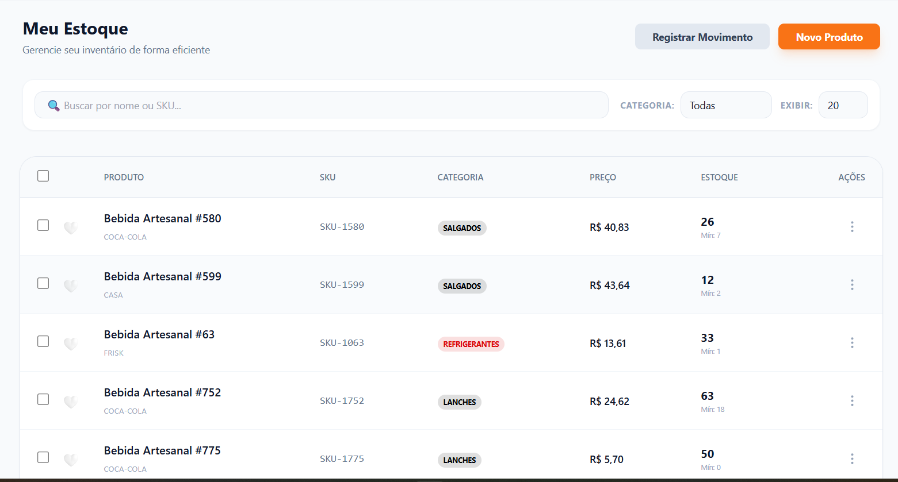
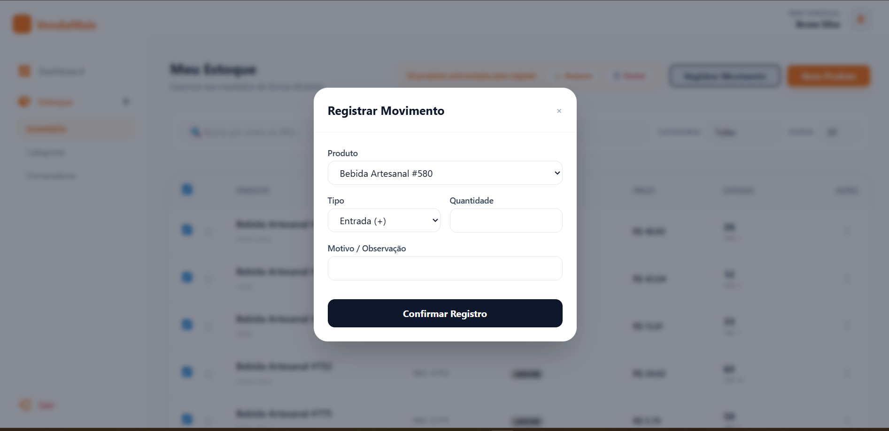
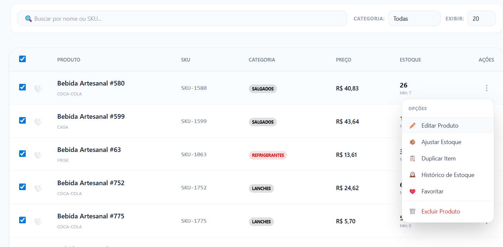
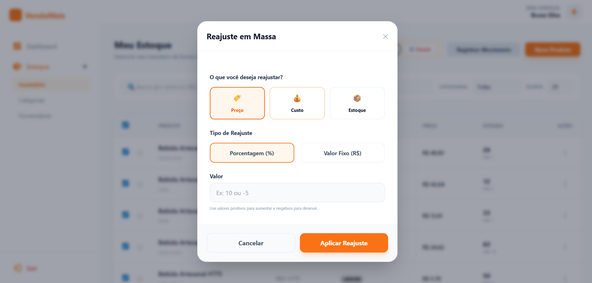
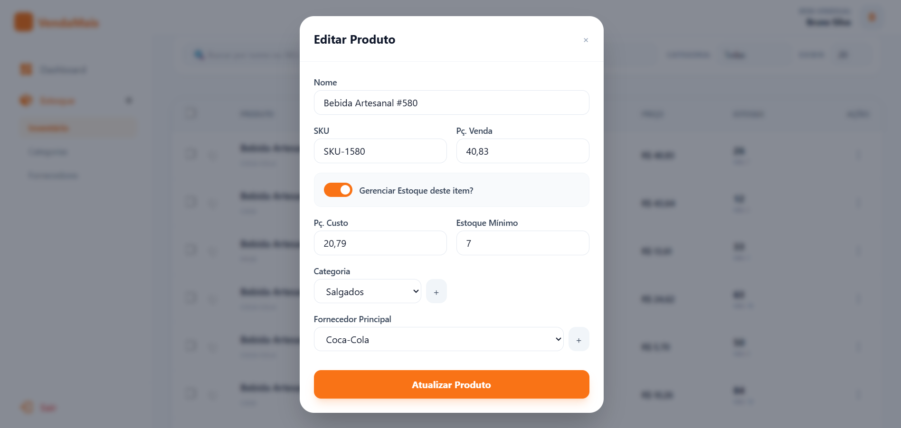

# VendaMais

VendaMais é uma aplicação web voltada para **gestão comercial**, focada no setor gastronômico e licenciada sob a **GPL-3.0**. 🎉

O projeto está em fase inicial e atualmente possui apenas a **base da aplicação** configurada.

Consulte o nosso [Guia de Contribuição](CONTRIBUTING.md) para saber como colaborar seguindo nossos padrões de arquitetura e design. 🛠️

---

## 📸 Demonstração do Sistema

Abaixo, apresentamos as primeiras interfaces da aplicação, desenvolvidas com foco na experiência do usuário e agilidade visual.

<div align="center">
  
  <p><i>Painel Geral de Indicadores</i></p>
  <br>
  
  
  <br>
  
  
</div>

---

## 🚀 Instalação Rápida

### Pré-requisitos

- **Docker** e **Docker Compose** (recomendado)
- **Node.js 18+** (para desenvolvimento local)
- **Git**

---

## 🐳 Opção 1: Docker (Recomendado)

Esta é a forma mais simples e rápida de rodar a aplicação em qualquer ambiente.

### Windows, Linux e macOS

```bash
# 1. Clone o repositório
git clone https://github.com/SEU-USUARIO/vendamais.git
cd vendamais

# 2. Configure as variáveis de ambiente
cp .env.example .env

# 3. Suba os containers com Docker
docker-compose up -d

# 4. Acesse a aplicação
# App: http://localhost:3000
# phpMyAdmin: http://localhost:8080
```

### Gerenciamento com Docker

```bash
# Ver status dos containers
docker-compose ps

# Ver logs da aplicação
docker-compose logs app

# Ver logs do MySQL
docker-compose logs mysql

# Reiniciar a aplicação
docker-compose restart app

# Gerenciar PM2 (process manager)
docker exec vendamais-app-1 pm2 list
docker exec vendamais-app-1 pm2 logs
docker exec vendamais-app-1 pm2 restart vendamais

# Parar todos os containers
docker-compose down

# Reconstruir imagem (após alterações no Dockerfile)
docker-compose up -d --build
```

---

## 💻 Opção 2: Desenvolvimento Local

### Instalação Manual

#### Windows (PowerShell)

```powershell
# 1. Clone o repositório
git clone https://github.com/SEU-USUARIO/vendamais.git
cd vendamais

# 2. Instale Node.js (se não tiver)
# Visite: https://nodejs.org/

# 3. Configure as variáveis de ambiente
Copy-Item .env.example .env

# 4. Instale dependências
npm install

# 5. Compile o Tailwind CSS
npm run tailwind:build

# 6. Inicie a aplicação
npm start
```

#### Linux/macOS

```bash
# 1. Clone o repositório
git clone https://github.com/SEU-USUARIO/vendamais.git
cd vendamais

# 2. Instale Node.js (se não tiver)
# Ubuntu/Debian: sudo apt install nodejs npm
# CentOS/RHEL: sudo yum install nodejs npm
# macOS: brew install node

# 3. Configure as variáveis de ambiente
cp .env.example .env

# 4. Instale dependências
npm install

# 5. Compile o Tailwind CSS
npm run tailwind:build

# 6. Inicie a aplicação
npm start
```

### Configuração do Banco de Dados (Local)

#### SQLite (Desenvolvimento - Padrão)

O projeto já vem configurado para usar SQLite em desenvolvimento. Basta criar o arquivo:

```bash
# Criar diretório do banco
mkdir -p database

# O arquivo database.sqlite será criado automaticamente
```

#### MySQL (Produção)

Se preferir usar MySQL localmente:

1. **Instale MySQL Server**
   - Windows: Download oficial do MySQL
   - Linux: `sudo apt install mysql-server` (Ubuntu)
   - macOS: `brew install mysql`

2. **Configure o banco**
   ```sql
   CREATE DATABASE vendamais;
   CREATE USER 'vendamais'@'localhost' IDENTIFIED BY 'sua_senha';
   GRANT ALL PRIVILEGES ON vendamais.* TO 'vendamais'@'localhost';
   FLUSH PRIVILEGES;
   ```

3. **Atualize o .env**
   ```env
   NODE_ENV=production
   DB_DIALECT=mysql
   DB_HOST=localhost
   DB_NAME=vendamais
   DB_USER=vendamais
   DB_PASSWORD=sua_senha
   DB_PORT=3306
   ```

---

## 🧱 Tecnologias Utilizadas

### Backend
- **Node.js 18** - Runtime JavaScript
- **Express.js** - Framework web
- **Sequelize ORM** - Mapeamento Objeto-Relacional
- **SQLite** - Banco de dados (desenvolvimento)
- **MySQL 8.0** - Banco de dados (produção)
- **PM2** - Process Manager (produção)

### Frontend
- **EJS** - Server Side Rendering
- **Express EJS Layouts** - Sistema de layouts
- **Tailwind CSS 3** - Framework CSS utilitário
- **JavaScript Vanilla** - Interatividade

### Infraestrutura
- **Docker & Docker Compose** - Contêineres
- **dotenv** - Variáveis de ambiente
- **express-session** - Gerenciamento de sessões
- **express-mysql-session** - Sessão persistente
- **morgan** - Logs HTTP
- **cookie-parser** - Cookies

---

## 📁 Estrutura da Arquitetura SaaS

```
vendamais/
├── controllers/
│   ├── admin/      # Lógica do painel administrativo
│   ├── site/       # Lógica do site institucional/landing page
│   └── user/       # Lógica do painel do cliente/usuário
├── middleware/     # Filtros de autenticação e validação
├── models/         # Modelos Sequelize (tabelas do BD)
├── routes/         # Definição de rotas por contexto
├── views/
│   ├── admin/      # Telas administrativas
│   ├── site/       # Telas do site (Pages e Components)
│   ├── user/       # Telas do cliente
│   └── errors/     # Páginas de erro (401, 404, 500, 502)
├── public/
│   ├── stylesheets/ # Tailwind compilado (style.css) e config (input.css)
│   ├── javascripts/ # Scripts frontend
│   └── uploads/    # Uploads de arquivos
├── database/       # Arquivos do banco de dados
├── docker-compose.yml
├── Dockerfile
├── ecosystem.config.js # Configuração PM2
├── app.js
├── tailwind.config.js
└── package.json
```

---

## 🎨 Design e UI

Utilizamos **Tailwind CSS** para garantir uma interface moderna, rápida e consistente. 

- **Estilo**: Glassmorphism, tipografia moderna (Outfit) e paleta vibrante
- **Compilação**: `npm run tailwind:build` para gerar o CSS final
- **Desenvolvimento**: `npm run tailwind:watch` para auto-rebuild durante a criação

### Comandos Úteis

```bash
# Desenvolvimento
npm run dev                    # Inicia com watch do Tailwind
npm run tailwind:watch         # Monitora alterações no CSS
npm run tailwind:build         # Compila CSS para produção

# Banco de Dados
npm run db:seed               # Popula banco com dados de teste

# Testes
npm test                      # Executa suíte de testes

# Git (utilitários)
npm run backup                # Commit automático com timestamp
npm run reset                 # Desfaz último commit
```

---

## 🔐 Configuração de Ambiente

### Variáveis de Ambiente (.env)

```env
# Configurações Globais
NODE_ENV=development          # development | production
SECRET=uma_chave_secreta_e_segura_aqui
SESSION_DURATION_HOURS=8

# Banco de Dados (Desenvolvimento - SQLite)
DB_DIALECT=sqlite
DB_STORAGE=./database/database.sqlite

# Banco de Dados (Produção - MySQL)
DB_HOST=localhost
DB_NAME=vendamais
DB_USER=root
DB_PASSWORD=
DB_PORT=3306
```

### Segurança

- **SECRET**: Use uma chave forte e única em produção
- **SESSION_DURATION**: Defina tempo adequado para sua aplicação
- **HTTPS**: Em produção, configure SSL/TLS

---

## 🐛 Troubleshooting

### Problemas Comuns

#### Docker
```bash
# Se os containers não iniciarem
docker-compose down -v
docker-compose up -d

# Se houver erro de permissão (Linux)
sudo chown -R $USER:$USER ./database

# Se a porta estiver ocupada
netstat -tulpn | grep :3000  # Linux
netstat -ano | findstr :3000 # Windows
```

#### Node.js Local
```bash
# Limpar cache do npm
npm cache clean --force

# Reinstalar dependências
rm -rf node_modules package-lock.json
npm install

# Erro de permissão (Linux/macOS)
chmod +x ./bin/www
```

#### Banco de Dados
```bash
# Resetar banco SQLite
rm -f ./database/database.sqlite

# Verificar conexão MySQL
mysql -h localhost -u root -p
```

### Logs e Monitoramento

#### Docker
```bash
# Logs em tempo real
docker-compose logs -f app

# Logs específicos do PM2
docker exec vendamais-app-1 pm2 logs
```

#### Desenvolvimento Local
```bash
# Logs da aplicação
npm start

# Verificar processos
ps aux | grep node  # Linux/macOS
tasklist | findstr node  # Windows
```

---

## 📊 Arquitetura e Padrões

### MVC (Model-View-Controller)

- **Models**: Camada de dados (Sequelize)
- **Views**: Camada de apresentação (EJS)
- **Controllers**: Lógica de negócio

### Middleware

- **Autenticação**: Verifica sessão do usuário
- **Autorização**: Controla acesso por perfil
- **Validação**: Sanitiza dados de entrada

### SaaS Multi-tenant

- **Contextos**: Admin, User, Site
- **Isolamento**: Controllers separados por contexto
- **Escalabilidade**: Arquitetura modular

---

## ✅ Checklist — Status Atual

### Base e Arquitetura
- [x] Express e Sequelize configurados
- [x] Arquitetura SaaS (Admin, User, Site) implementada
- [x] Controllers separados por contexto
- [x] Tailwind CSS integrado e configurado
- [x] Docker Compose configurado
- [x] PM2 configurado para produção
- [x] Tratamento de erros global (401, 404, 500, 502)

### Próximos Passos
- [ ] Implementar sistema completo de Autenticação (Login/Registro)
- [ ] Desenvolver telas CRUD para o Módulo de Estoque
- [ ] Criar componentes reutilizáveis com Tailwind
- [ ] Configurar CI/CD para deploy automático

---

## 🤝 Contribuição

1. Fork o projeto
2. Crie uma branch (`git checkout -b feature/nova-funcionalidade`)
3. Commit suas mudanças (`git commit -m 'Adiciona nova funcionalidade'`)
4. Push para a branch (`git push origin feature/nova-funcionalidade`)
5. Abra um Pull Request

---

## 📄 Licença

Este projeto está licenciado sob a **GPL-3.0**. Veja o arquivo [LICENSE](LICENSE) para detalhes.

---

## 📞 Suporte

- **Issues**: [GitHub Issues](https://github.com/SEU-USUARIO/vendamais/issues)
- **Discussions**: [GitHub Discussions](https://github.com/SEU-USUARIO/vendamais/discussions)
- **Email**: suporte@vendamais.com

---

🟢 **Arquitetura Base Concluída**

O projeto agora possui uma fundação sólida e escalável, pronta para o desenvolvimento acelerado dos módulos de negócio.