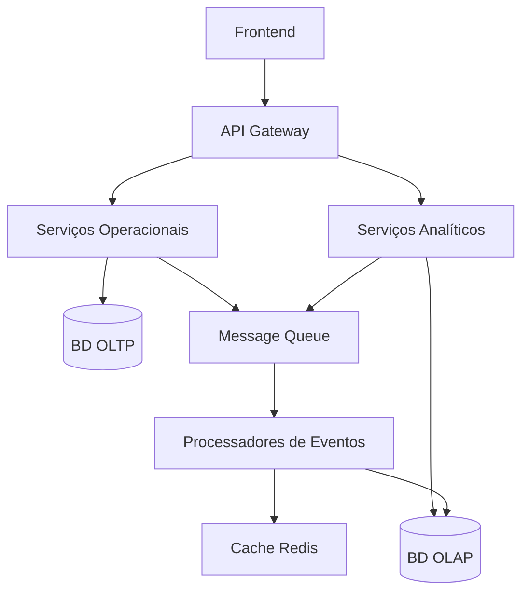
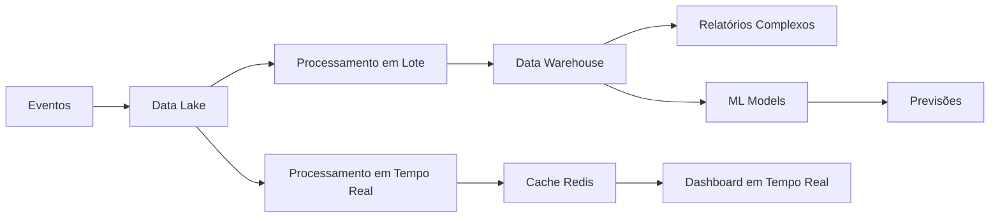
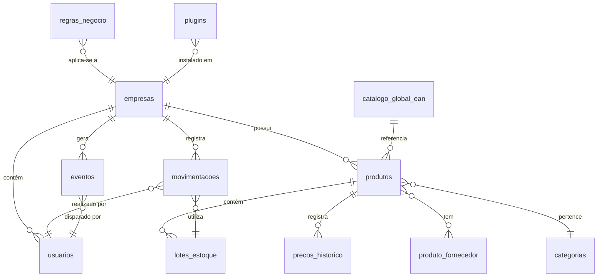
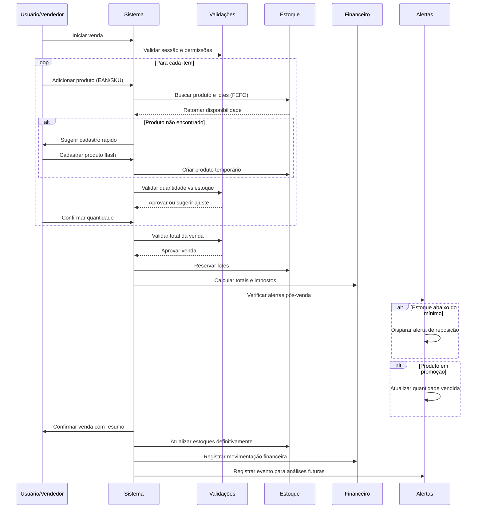

# Plano de Desenvolvimento - Gestor de Estoque Inteligente  
*SaaS Multiempresa com Inteligência Coletiva e Controle Financeiro Histórico*

---

## Índice

1. [Visão Geral do Sistema](#1-visão-geral-do-sistema)
2. [Arquitetura em Camadas (Operação vs Inteligência)](#2-arquitetura-em-camadas-operação-vs-inteligência)
3. [Arquitetura Multiempresa (Multitenancy)](#3-arquitetura-multiempresa-multitenancy)
4. [Catálogo Global Inteligente com Governança](#4-catálogo-global-inteligente-com-governança)
5. [Fluxos de Cadastro de Produtos](#5-fluxos-de-cadastro-de-produtos)
6. [Gestão Avançada de Estoques com Estados Claros](#6-gestão-avançada-de-estoques-com-estados-claros)
7. [Arquitetura Baseada em Eventos](#7-arquitetura-baseada-em-eventos)
8. [Inteligência de Estoque (OLAP)](#8-inteligência-de-estoque-olap)
9. [Regras de Negócio como Código Declarativo](#9-regras-de-negócio-como-código-declarativo)
10. [Controle de Consistência e Antifalhas](#10-controle-de-consistência-e-antifalhas)
11. [Experiência do Usuário (UX)](#11-experiência-do-usuário-ux)
12. [Extensibilidade e Plugins](#12-extensibilidade-e-plugins)
13. [Modelo de Dados](#13-modelo-de-dados)
14. [Otimização de Performance](#14-otimização-de-performance)
15. [Segurança e Multitenancy Reforçada](#15-segurança-e-multitenancy-reforçada)
16. [Métricas de Produto](#16-métricas-de-produto)
17. [Fluxos Operacionais](#17-fluxos-operacionais)
18. [Roadmap de Evolução](#18-roadmap-de-evolução)
19. [Conclusão](#19-conclusão)

---

## 1. Visão Geral do Sistema

Sistema **SaaS multiempresa** para gestão de estoques com foco na realidade brasileira, oferecendo:

| Funcionalidade | Benefício |
|----------------|-----------|
| **Isolamento completo entre empresas** | Segurança e privacidade garantidas |
| **Inteligência coletiva via catálogo global** | Redução de 70% no tempo de cadastro |
| **Controle financeiro histórico com snapshots** | Precisão contábil mesmo com mudanças de preço |
| **Gestão de perecíveis com FEFO/PVPS** | Redução de perdas e otimização de giro |
| **Análises preditivas baseadas em ML** | Sugestões inteligentes de compra e reposição |
| **Arquitetura baseada em eventos** | Auditabilidade perfeita e extensibilidade |
| **Governança rigorosa de dados** | Qualidade consistente e confiabilidade |

---

## 2. Arquitetura em Camadas (Operação vs Inteligência)

### 2.1 Core Operacional (OLTP - Transacional)
**Responsabilidade:** Processamento de operações em tempo real
- Cadastro de produtos, fornecedores, categorias
- Movimentações de estoque (entradas, saídas, ajustes)
- Gestão de lotes e validades
- Controle de usuários e permissões

### 2.2 Camada Analítica (OLAP - Inteligência)
**Responsabilidade:** Processamento assíncrono de análises
- Cálculo de curva ABC
- Previsões de demanda e sazonalidade
- Análise de giro e rentabilidade
- Geração de relatórios complexos

### 2.3 Separação Técnica


---

## 3. Arquitetura Multiempresa (Multitenancy)

### 3.1 Estratégia: Tenant Context Obrigatório
```typescript
// Middleware obrigatório em todas as requisições
class TenantContext {
  private empresaId: string;
  private usuarioId: string;
  
  // Bloqueia queries sem tenant
  static enforce(empresaId: string) {
    if (!empresaId) throw new Error('TENANT_CONTEXT_REQUIRED');
  }
}
```

### 3.2 Implementação Técnica
```sql
-- Todas as tabelas incluem empresa_id como parte da PK
CREATE TABLE produtos (
    id UUID,
    empresa_id UUID NOT NULL,
    PRIMARY KEY (id, empresa_id),
    FOREIGN KEY (empresa_id) REFERENCES empresas(id)
);

-- Row Level Security (RLS) obrigatório
ALTER TABLE produtos ENABLE ROW LEVEL SECURITY;
CREATE POLICY produtos_tenant_policy ON produtos
    USING (empresa_id = current_setting('app.current_empresa_id'));
```

### 3.3 Testes Automatizados de Isolamento
```python
def test_tenant_isolation():
    # Teste que falha se uma query esquecer o filtro
    empresa_a = criar_empresa()
    empresa_b = criar_empresa()
    
    # Criar produto na empresa A
    produto = criar_produto(empresa_a)
    
    # Tentar acessar da empresa B (deve falhar)
    with pytest.raises(TenantViolationError):
        acessar_produto(empresa_b, produto.id)
```

---

## 4. Catálogo Global Inteligente com Governança

### 4.1 Estrutura Aprimorada
```sql
CREATE TABLE catalogo_global_ean (
    -- Identificação
    ean VARCHAR(13) PRIMARY KEY,
    nome_produto VARCHAR(255) NOT NULL,
    
    -- Governança
    nivel_confianca INTEGER DEFAULT 50 CHECK (nivel_confianca BETWEEN 0 AND 100),
    origem ENUM('fabricante', 'usuário', 'importado', 'parceiro') DEFAULT 'usuário',
    status ENUM('pendente', 'validado', 'rejeitado', 'arquivado') DEFAULT 'pendente',
    
    -- Metadados de qualidade
    quantidade_fontes INTEGER DEFAULT 1,
    data_primeiro_cadastro TIMESTAMP DEFAULT NOW(),
    data_ultima_verificacao TIMESTAMP,
    moderado_por UUID REFERENCES usuarios(id),
    
    -- Dados do produto
    foto_url TEXT,
    categoria_sugerida VARCHAR(100),
    ncm VARCHAR(8),
    marca VARCHAR(100),
    modelo VARCHAR(100),
    
    -- Controles
    versao INTEGER DEFAULT 1,
    hash_verificacao VARCHAR(64)
);

-- Tabela de histórico de modificações
CREATE TABLE catalogo_global_historico (
    id UUID PRIMARY KEY,
    ean VARCHAR(13) REFERENCES catalogo_global_ean(ean),
    usuario_id UUID,
    alteracao JSONB,
    motivo VARCHAR(500),
    data_hora TIMESTAMP DEFAULT NOW()
);
```

### 4.2 Fluxo de Governança
```mermaid
graph TD
    A[Novo EAN escaneado] --> B{Catálogo Global?}
    B -->|Não| C[Criar entrada com status "pendente"]
    B -->|Sim| D[Usar dados existentes]
    
    C --> E[Processo de Validação]
    subgraph E [Validação em 3 níveis]
        E1[Nível 1: Multiplicidade]
        E2[Nível 2: Consistência]
        E3[Nível 3: Moderador]
    end
    
    E --> F{Status Final}
    F -->|Validado| G[Disponível para todas empresas]
    F -->|Rejeitado| H[Arquivado com motivo]
    F -->|Pendente| I[Aguardando mais dados]
```

### 4.3 Regras de Qualidade
```yaml
regras_validacao:
  nivel_confianca:
    - 1-30: "Baixo (apenas 1 fonte)"
    - 31-70: "Médio (2-4 fontes consistentes)"
    - 71-90: "Alto (5+ fontes ou fabricante)"
    - 91-100: "Crítico (verificado por moderador)"
    
  promocao_automatica:
    condicao: "quantidade_fontes >= 3 AND nivel_confianca >= 70"
    acao: "status = 'validado'"
    
  alertas_moderacao:
    - "nivel_confianca < 30 por mais de 7 dias"
    - "dados inconsistentes entre fontes"
    - "sugestão de categoria improvável"
```

---

## 5. Fluxos de Cadastro de Produtos

### 5.1 Três Modos de Cadastro

#### Modo Flash (Operação Rápida)
```json
{
  "modo": "flash",
  "campos_obrigatorios": ["nome", "quantidade"],
  "campos_opcionais": ["preco_venda"],
  "tempo_estimado": "15 segundos",
  "uso": "entrada emergencial de mercadoria"
}
```

#### Modo Básico (Cadastro Diário)
```json
{
  "modo": "basico",
  "campos": [
    "nome", "categoria", "custo", 
    "preco_venda", "quantidade", "imagem"
  ],
  "inteligencia": "sugestao_categoria_por_nome"
}
```

#### Modo Avançado (Master Data)
```yaml
modo: "avancado"
inteligencia_ativa: true
fluxo:
  1. scan_ean_ou_digita
  2. busca_catalogo_global
  3. preenche_automaticamente:
     - nome
     - imagem
     - categoria_sugerida
     - ncm
     - marca/modelo
  4. usuario_completa:
     - precos: [custo, venda, margem_automatica]
     - estoque: [minimo, maximo, localizacao]
     - fornecedores: [primario, secundarios]
     - controles: [lotes, validade, unidade]
campos_avancados:
  - curva_abc_pre_sugerida
  - multiplas_imagens
  - documentos_anexos
  - atributos_customizados
```

### 5.2 Validações em Tempo Real
```javascript
class ProductValidator {
  async validate(productData) {
    const errors = [];
    
    // Validação de EAN
    if (productData.ean) {
      const existsInGlobal = await checkGlobalCatalog(productData.ean);
      if (existsInGlobal && existsInGlobal.nivel_confianca > 70) {
        // Sugere uso dos dados globais
        productData.suggestions = existsInGlobal;
      }
    }
    
    // Validação de preços
    if (productData.custo && productData.preco_venda) {
      const margem = this.calculateMargin(productData);
      if (margem < 0) errors.push('PRECO_VENDA_ABAIXO_CUSTO');
      if (margem > 1000) errors.push('MARGEM_IMPROVAVEL');
    }
    
    // Validação de NCM
    if (productData.ncm) {
      const validNCM = await validateNCM(productData.ncm);
      if (!validNCM) errors.push('NCM_INVALIDO');
    }
    
    return { isValid: errors.length === 0, errors, suggestions };
  }
}
```

---

## 6. Gestão Avançada de Estoques com Estados Claros

### 6.1 Estados de Produto (Antifalhas)
```sql
CREATE TYPE produto_status AS ENUM (
  'ativo',           -- Disponível para operações
  'descontinuado',   -- Não comprar mais, mas vender estoque
  'bloqueado',       -- Problema fiscal/sanitário
  'somente_leitura', -- Histórico, não movimenta
  'rascunho'         -- Cadastro incompleto
);

-- Adicionar à tabela produtos
ALTER TABLE produtos ADD COLUMN status produto_status DEFAULT 'ativo';
```

### 6.2 Estados de Lote
```sql
CREATE TYPE lote_status AS ENUM (
  'ativo',           -- Disponível para vendas
  'reservado',       -- Reservado para pedido específico
  'vencendo',        -- Validade próxima (15-30 dias)
  'vencido',         -- Passou da validade
  'esgotado',        -- Quantidade zerada
  'quarentena',      -- Aguardando inspeção
  'devolvido'        -- Retorno do cliente
);

-- Adicionar à tabela lotes_estoque
ALTER TABLE lotes_estoque ADD COLUMN status lote_status DEFAULT 'ativo';

-- Índices para consultas frequentes
CREATE INDEX idx_lotes_status_validade 
ON lotes_estoque(empresa_id, status, data_validade);
```

### 6.3 Transições de Estado Controladas
```yaml
transicoes_permitidas:
  produto:
    ativo: ["descontinuado", "bloqueado", "somente_leitura"]
    descontinuado: ["ativo", "somente_leitura"]
    bloqueado: ["ativo"]  # Requer justificativa
    somente_leitura: []   # Irreversível (histórico)
    
  lote:
    ativo: ["reservado", "vencendo", "esgotado", "quarentena"]
    reservado: ["ativo", "esgotado"]
    vencendo: ["vencido", "esgotado"]
    vencido: ["devolvido"]  # Com registro de destino
    quarentena: ["ativo", "devolvido"]
    
validacoes_transicao:
  - "Produto bloqueado não pode ter movimentações"
  - "Lote vencido não pode ser vendido"
  - "Reserva requer pedido associado"
  - "Transição para vencido notifica responsável"
```

---

## 7. Arquitetura Baseada em Eventos

### 7.1 Catálogo de Eventos do Sistema
```typescript
interface SistemaEvent {
  id: string;
  tipo: string;
  empresa_id: string;
  usuario_id: string;
  data_hora: Date;
  payload: Record<string, any>;
  metadata: {
    ip: string;
    user_agent: string;
    versao_api: string;
  };
}

// Eventos Principais
type EventoTipo = 
  | 'EstoqueEntradaCriada'
  | 'VendaRealizada'
  | 'ProdutoCriado'
  | 'ProdutoAtualizado'
  | 'LoteVencido'
  | 'ProdutoAbaixoMinimo'
  | 'PrecoAlterado'
  | 'FornecedorAtualizado'
  | 'MovimentacaoAjustada'
  | 'AlertaDisparado'
  | 'UsuarioAutenticado';
```

### 7.2 Implementação do Event Bus
```python
class EventBus:
    def __init__(self):
        self.subscribers = defaultdict(list)
    
    def publish(self, event: SistemaEvent):
        # Armazenar no histórico
        self.store_event(event)
        
        # Notificar assinantes síncronos
        for handler in self.subscribers.get(event.tipo, []):
            handler(event)
        
        # Publicar na fila para processamento assíncrono
        self.queue.publish('sistema-eventos', event)
    
    def subscribe(self, event_type: str, handler: callable):
        self.subscribers[event_type].append(handler)

# Exemplo de uso
event_bus.subscribe('VendaRealizada', calcular_curva_abc)
event_bus.subscribe('VendaRealizada', atualizar_previsoes)
event_bus.subscribe('ProdutoAbaixoMinimo', enviar_alerta_reposicao)
```

### 7.3 Tabela de Eventos para Auditoria
```sql
CREATE TABLE eventos_sistema (
    id UUID PRIMARY KEY DEFAULT gen_random_uuid(),
    tipo VARCHAR(100) NOT NULL,
    empresa_id UUID NOT NULL REFERENCES empresas(id),
    usuario_id UUID REFERENCES usuarios(id),
    
    -- Dados do evento
    payload JSONB NOT NULL,
    metadata JSONB,
    
    -- Controle
    processado BOOLEAN DEFAULT FALSE,
    processado_em TIMESTAMP,
    erro_processamento TEXT,
    
    -- Auditoria
    data_hora TIMESTAMP DEFAULT NOW(),
    ip_origem INET,
    user_agent TEXT
);

-- Índices para consultas de auditoria
CREATE INDEX idx_eventos_empresa_data ON eventos_sistema(empresa_id, data_hora DESC);
CREATE INDEX idx_eventos_tipo ON eventos_sistema(tipo);
CREATE INDEX idx_eventos_nao_processados ON eventos_sistema(empresa_id) 
WHERE processado = FALSE;
```

### 7.4 Processadores de Eventos
```yaml
processadores:
  atualizacao_cache_produto:
    evento: ["EstoqueEntradaCriada", "VendaRealizada", "MovimentacaoAjustada"]
    acao: "recalcular_cache_produto"
    prioridade: "alta"
    timeout: "5s"
  
  alertas_estoque:
    evento: ["VendaRealizada", "EstoqueEntradaCriada"]
    acao: "verificar_limites_estoque"
    prioridade: "media"
    timeout: "10s"
  
  analise_sazonal:
    evento: ["VendaRealizada"]
    acao: "atualizar_analise_sazonal"
    prioridade: "baixa"
    timeout: "30s"
    batch_size: 100
  
  integracao_externa:
    evento: ["ProdutoCriado", "ProdutoAtualizado"]
    acao: "sincronizar_marketplaces"
    prioridade: "media"
    retry_policy: "exponential_backoff"
```

---

## 8. Inteligência de Estoque (OLAP)

### 8.1 Arquitetura da Camada Analítica


### 8.2 Tabelas OLAP para Análise
```sql
-- Tabela de fatos para análise de vendas
CREATE TABLE fato_vendas (
    data_id DATE NOT NULL,
    empresa_id UUID NOT NULL,
    produto_id UUID NOT NULL,
    categoria_id UUID,
    usuario_id UUID,
    
    -- Métricas
    quantidade DECIMAL(10,3) NOT NULL,
    valor_venda DECIMAL(10,2) NOT NULL,
    valor_custo DECIMAL(10,2) NOT NULL,
    margem DECIMAL(10,2) GENERATED ALWAYS AS (valor_venda - valor_custo) STORED,
    
    -- Dimensões
    hora INTEGER,
    canal_venda VARCHAR(50),
    cidade VARCHAR(100),
    
    -- Metadados
    processado_em TIMESTAMP DEFAULT NOW(),
    
    PRIMARY KEY (data_id, empresa_id, produto_id, hora)
) PARTITION BY RANGE (data_id);

-- Tabela de previsões
CREATE TABLE previsoes_demanda (
    id UUID PRIMARY KEY,
    empresa_id UUID NOT NULL,
    produto_id UUID NOT NULL,
    
    -- Período
    data_inicio DATE NOT NULL,
    data_fim DATE NOT NULL,
    
    -- Previsões
    quantidade_prevista DECIMAL(10,3),
    intervalo_confianca_min DECIMAL(10,3),
    intervalo_confianca_max DECIMAL(10,3),
    
    -- Metadados do modelo
    modelo_utilizado VARCHAR(100),
    precisao_modelo DECIMAL(5,4),
    features_utilizadas JSONB,
    
    -- Controle
    gerado_em TIMESTAMP DEFAULT NOW(),
    valido_ate TIMESTAMP
);
```

### 8.3 Algoritmos de Previsão
```python
class DemandForecaster:
    def __init__(self, empresa_id):
        self.empresa_id = empresa_id
        
    def forecast(self, produto_id, horizon_days=30):
        # 1. Coletar dados históricos
        historico = self.get_sales_history(produto_id)
        
        # 2. Aplicar múltiplos modelos
        modelos = {
            'media_movel': self.moving_average(historico),
            'holt_winters': self.holt_winters(historico),
            'prophet': self.prophet_forecast(historico),
            'lstm': self.lstm_forecast(historico)  # Para séries complexas
        }
        
        # 3. Ensemble weighting baseado na acurácia histórica
        previsao_final = self.weighted_ensemble(modelos)
        
        # 4. Ajustar por sazonalidade conhecida
        previsao_final = self.apply_seasonality(previsao_final)
        
        # 5. Ajustar por eventos futuros conhecidos
        previsao_final = self.apply_known_events(previsao_final)
        
        return previsao_final
```

---

## 9. Regras de Negócio como Código Declarativo

### 9.1 Arquitetura de Regras
```yaml
sistema_regras:
  motor: "json-rules-engine"
  formato: "yaml"
  versionamento: "semantic"
  
  repositório:
    path: "/regras"
    estrutura:
      - "estoque/"
      - "precos/"
      - "validacoes/"
      - "alertas/"
    backup_automatico: true
```

### 9.2 Exemplo de Regras em YAML
```yaml
# regras/estoque/controle_minimo_maximo.yaml
regra_id: "estoque_minimo_maximo"
versao: "1.2.0"
descricao: "Controle de limites de estoque"
empresa_scope: "todas"  # ou lista de IDs

condicoes:
  - name: "estoque_abaixo_minimo"
    condition: "qtd_total < estoque_minimo"
    severity: "alta"
    acao:
      tipo: "gerar_alerta"
      template: "alerta_estoque_baixo"
      canal: ["email", "push", "dashboard"]
      prioridade: 1
      
  - name: "estoque_acima_maximo"
    condition: "qtd_total > estoque_maximo"
    severity: "media"
    acao:
      tipo: "gerar_alerta"
      template: "alerta_estoque_excesso"
      canal: ["dashboard"]
      prioridade: 2
      
  - name: "produto_parado"
    condition: "qtd_total > 0 AND ultima_venda_dias > 60"
    severity: "baixa"
    acao:
      tipo: "sugerir_promocao"
      parametros:
        desconto_minimo: 0.10
        desconto_maximo: 0.30

execucao:
  frequencia: "diaria"
  horario: "02:00"
  timeout: "5m"
  batch_size: 1000
```

### 9.3 Motor de Regras
```typescript
class RulesEngine {
  private rules: Map<string, RegraNegocio>;
  
  async evaluate(context: AvaliacaoContext) {
    const results: ResultadoRegra[] = [];
    
    for (const [ruleId, rule] of this.rules) {
      // Verificar se a regra se aplica ao contexto
      if (await this.appliesToContext(rule, context)) {
        const result = await rule.evaluate(context);
        results.push({
          ruleId,
          result,
          actions: result.matches ? rule.actions : []
        });
      }
    }
    
    // Executar ações das regras que "bateram"
    await this.executeActions(results);
    
    return results;
  }
  
  async executeActions(results: ResultadoRegra[]) {
    for (const result of results.filter(r => r.actions.length > 0)) {
      for (const action of result.actions) {
        await this.executeAction(action, result.context);
      }
    }
  }
}
```

### 9.4 Interface de Gerenciamento de Regras
```yaml
# API para gerenciamento de regras
endpoints:
  GET /api/v1/regras: "Listar regras"
  GET /api/v1/regras/{id}: "Detalhar regra"
  POST /api/v1/regras: "Criar nova regra"
  PUT /api/v1/regras/{id}: "Atualizar regra"
  DELETE /api/v1/regras/{id}: "Remover regra"
  POST /api/v1/regras/{id}/teste: "Testar regra"
  GET /api/v1/regras/{id}/historico: "Histórico de execução"
```

---

## 10. Controle de Consistência e Antifalhas

### 10.1 Jobs de Verificação Automática
```python
class ConsistencyChecker:
    def __init__(self):
        self.checks = [
            self.check_stock_consistency,
            self.check_price_snapshots,
            self.check_lot_expirations,
            self.check_negative_stock,
            self.check_orphaned_records,
            self.check_duplicate_products
        ]
    
    async def run_daily_checks(self, empresa_id):
        results = []
        
        for check in self.checks:
            try:
                result = await check(empresa_id)
                results.append({
                    'check': check.__name__,
                    'status': 'completed',
                    'issues_found': len(result.issues),
                    'issues': result.issues
                })
                
                # Auto-correção quando possível
                if result.auto_fixable:
                    await self.auto_fix(result.issues)
            except Exception as e:
                results.append({
                    'check': check.__name__,
                    'status': 'failed',
                    'error': str(e)
                })
        
        return results
    
    async def check_stock_consistency(self, empresa_id):
        """Verifica se soma dos lotes = cache do produto"""
        issues = []
        
        query = """
        SELECT p.id, p.nome, p.qtd_total_atual as cache,
               COALESCE(SUM(l.quantidade_atual), 0) as soma_lotes
        FROM produtos p
        LEFT JOIN lotes_estoque l ON p.id = l.produto_id 
            AND l.status IN ('ativo', 'vencendo', 'reservado')
        WHERE p.empresa_id = %s
        GROUP BY p.id, p.nome, p.qtd_total_atual
        HAVING ABS(p.qtd_total_atual - COALESCE(SUM(l.quantidade_atual), 0)) > 0.001
        """
        
        inconsistencies = await db.query(query, [empresa_id])
        
        for inc in inconsistencies:
            issues.append({
                'type': 'STOCK_INCONSISTENCY',
                'product_id': inc.id,
                'product_name': inc.nome,
                'cache_value': inc.cache,
                'sum_lots': inc.soma_lotes,
                'difference': abs(inc.cache - inc.soma_lotes),
                'auto_fixable': True
            })
        
        return {'issues': issues, 'auto_fixable': True}
```

### 10.2 Dashboard de Saúde do Sistema
```json
{
  "data_verificacao": "2024-01-15T02:30:00Z",
  "empresa_id": "123e4567-e89b-12d3-a456-426614174000",
  "checks_executados": 12,
  "checks_com_sucesso": 11,
  "checks_com_falha": 1,
  "issues_encontradas": 3,
  "issues_corrigidas": 2,
  "issues_requerem_acao": 1,
  "detalhes_checks": [
    {
      "nome": "Consistência de Estoque",
      "status": "success",
      "tempo_execucao": "2.1s",
      "issues": 0
    },
    {
      "nome": "Snapshots de Preço",
      "status": "success",
      "tempo_execucao": "1.8s",
      "issues": 0
    },
    {
      "nome": "Validades Próximas",
      "status": "warning",
      "tempo_execucao": "3.2s",
      "issues": 2,
      "detalhes": [
        {
          "tipo": "LOTE_VENCENDO",
          "produto": "Leite UHT Integral 1L",
          "lote": "L20231215",
          "dias_para_vencer": 12,
          "acao_sugerida": "Mover para frente ou promoção"
        }
      ]
    }
  ]
}
```

---

## 11. Experiência do Usuário (UX)

### 11.1 Dashboard Inteligente
```typescript
interface DashboardData {
  // KPIs em tempo real
  kpis: {
    valorEstoqueTotal: { valor: number; tendencia: 'up' | 'down' | 'stable' };
    itensBaixoEstoque: { valor: number; criticos: number };
    itensVencendo30Dias: { valor: number; criticos: number };
    giroEstoque: { valor: number; meta: number };
    capitalParado: { valor: number; percentual: number };
  };
  
  // Alertas priorizados
  alertas: Array<{
    id: string;
    tipo: 'ruptura' | 'validade' | 'excesso' | 'financeiro';
    nivel: 'critico' | 'alerta' | 'informacao';
    produto: string;
    mensagem: string;
    acaoRapida?: string;
    data: Date;
  }>;
  
  // Gráficos inteligentes
  graficos: {
    curvaABC: { categoria: 'A' | 'B' | 'C'; produtos: number; faturamento: number }[];
    evolucaoEstoqueVsVendas: { data: string; estoque: number; vendas: number }[];
    top10Produtos: { produto: string; quantidade: number; faturamento: number }[];
    sazonalidade: { mes: string; mediaVendas: number; previsao: number }[];
  };
  
  // Sugestões automatizadas
  sugestoes: Array<{
    tipo: 'compra' | 'promocao' | 'ajuste' | 'auditoria';
    prioridade: number;
    descricao: string;
    impactoEstimado: string;
    acaoRecomendada: string;
  }>;
}
```

### 11.2 Recursos de Produtividade
```yaml
recursos_produtividade:
  acoes_em_massa:
    - "atualizar_precos"
    - "alterar_categorias"
    - "ajustar_estoques"
    - "aplicar_descontos"
    - "enviar_para_fornecedor"
  
  favoritos:
    max_itens: 50
    sincronizacao_cross_device: true
    categorizacao: ["mais_vendidos", "mais_ajustados", "manualmente"]
  
  clonagem_inteligente:
    copiar: ["dados_basicos", "fornecedores", "precos", "imagens"]
    ajustar: ["sku", "codigo_barras"]
    validar: ["unicidade", "compatibilidade"]
  
  importacao_exportacao:
    formatos_suportados: ["csv", "excel", "json", "xml"]
    mapeamento_automatico: true
    validacao_em_lote: true
    limite_registros: 10000
  
  modais_confirmacao:
    acoes_criticas: ["excluir", "baixar_estoque", "alterar_preco_custo"]
    niveis_confirmacao:
      - "informacao": 1_clique
      - "alerta": 2_cliques
      - "critico": senha_ou_2fa
```

---

## 12. Extensibilidade e Plugins

### 12.1 Arquitetura de Plugins
```typescript
interface PluginSystem {
  // Interface base para plugins
  interface Plugin {
    id: string;
    name: string;
    version: string;
    description: string;
    author: string;
    
    // Hooks disponíveis
    hooks: {
      onProductCreate?: (product: Product) => Promise<void>;
      onSaleComplete?: (sale: Sale) => Promise<void>;
      onStockAlert?: (alert: StockAlert) => Promise<void>;
      // ... outros hooks
    };
    
    // Configurações
    configSchema: JSONSchema;
    defaultConfig: Record<string, any>;
    
    // Métodos de ciclo de vida
    initialize(config: Record<string, any>): Promise<void>;
    destroy(): Promise<void>;
  }
  
  // Sistema de registro
  class PluginRegistry {
    private plugins: Map<string, Plugin> = new Map();
    
    register(plugin: Plugin): void {
      this.plugins.set(plugin.id, plugin);
      this.initializePlugin(plugin);
    }
    
    async executeHook(hookName: string, data: any): Promise<void> {
      for (const plugin of this.plugins.values()) {
        if (plugin.hooks[hookName]) {
          await plugin.hooks[hookName](data);
        }
      }
    }
  }
}
```

### 12.2 Catálogo de Plugins
```yaml
plugins_disponiveis:
  - id: "integracao-fiscal"
    nome: "Integração Fiscal"
    descricao: "Geração automática de documentos fiscais"
    categoria: "fiscal"
    preco: "plano_pro_ou_superior"
    hooks: ["onSaleComplete", "onProductCreate"]
  
  - id: "marketplace-mercado-livre"
    nome: "Mercado Livre"
    descricao: "Sincronização de produtos e estoque"
    categoria: "marketplace"
    preco: "adicional"
    hooks: ["onProductUpdate", "onStockChange"]
  
  - id: "relatorios-avancados"
    nome: "Relatórios Avançados"
    descricao: "Relatórios personalizados e exportação"
    categoria: "analytics"
    preco: "plano_business_ou_superior"
    hooks: ["onDataExport"]
  
  - id: "controle-producao"
    nome: "Controle de Produção"
    descricao: "Gestão de matérias-primas e produção"
    categoria: "manufacturing"
    preco: "personalizado"
    hooks: ["onRawMaterialUsage", "onProductionComplete"]
```

### 12.3 API de Extensibilidade
```typescript
// API pública para desenvolvedores
class EstoqueAPI {
  // Produtos
  async getProducts(filters: ProductFilters): Promise<Product[]>;
  async createProduct(product: ProductCreate): Promise<Product>;
  async updateProduct(id: string, updates: Partial<Product>): Promise<Product>;
  
  // Estoque
  async getStock(productId: string): Promise<StockInfo>;
  async updateStock(productId: string, adjustment: StockAdjustment): Promise<void>;
  
  // Vendas
  async recordSale(sale: SaleRecord): Promise<SaleReceipt>;
  async getSalesHistory(filters: SalesFilters): Promise<Sale[]>;
  
  // Webhooks
  async registerWebhook(event: string, url: string): Promise<Webhook>;
  async listWebhooks(): Promise<Webhook[]>;
  async deleteWebhook(id: string): Promise<void>;
}

// SDK para desenvolvedores
class EstoqueSDK {
  constructor(apiKey: string, empresaId: string);
  
  // Métodos simplificados
  products: ProductManager;
  stock: StockManager;
  sales: SalesManager;
  webhooks: WebhookManager;
}
```

---

## 13. Modelo de Dados

### 13.1 Diagrama de Entidades


### 13.2 Tabelas Principais

#### Empresas
```sql
CREATE TABLE empresas (
    id UUID PRIMARY KEY DEFAULT gen_random_uuid(),
    
    -- Identificação
    nome_fantasia VARCHAR(255) NOT NULL,
    razao_social VARCHAR(255) NOT NULL,
    cnpj VARCHAR(14) UNIQUE NOT NULL,
    
    -- Status
    status ENUM('ativa', 'inativa', 'suspensa') DEFAULT 'ativa',
    plano ENUM('basic', 'pro', 'business', 'enterprise') DEFAULT 'basic',
    
    -- Configurações
    configuracoes JSONB DEFAULT '{}',
    timezone VARCHAR(50) DEFAULT 'America/Sao_Paulo',
    idioma VARCHAR(10) DEFAULT 'pt_BR',
    
    -- Controle
    data_cadastro TIMESTAMP DEFAULT NOW(),
    data_atualizacao TIMESTAMP,
    data_expiracao_plano DATE,
    
    -- Limites (soft limits)
    limite_produtos INTEGER DEFAULT 1000,
    limite_usuarios INTEGER DEFAULT 5,
    limite_armazenamento_mb INTEGER DEFAULT 1024,
    
    -- Auditoria
    criado_por UUID REFERENCES usuarios(id)
);
```

#### Produtos (Versão Aprimorada)
```sql
CREATE TABLE produtos (
    id UUID PRIMARY KEY DEFAULT gen_random_uuid(),
    empresa_id UUID NOT NULL REFERENCES empresas(id),
    
    -- Identificação
    ean VARCHAR(13),
    nome VARCHAR(255) NOT NULL,
    sku VARCHAR(50),
    codigo_barras_interno VARCHAR(50),
    
    -- Relacionamentos
    categoria_id UUID REFERENCES categorias(id),
    unidade_medida ENUM('UN', 'KG', 'LT', 'M', 'CX', 'PCT') DEFAULT 'UN',
    
    -- Classificação
    ncm VARCHAR(8),
    cest VARCHAR(7),
    origem ENUM('0', '1', '2', '3', '4', '5', '6', '7', '8') DEFAULT '0',
    
    -- Status
    status produto_status DEFAULT 'ativo',
    visibilidade ENUM('publico', 'privado', 'restrito') DEFAULT 'publico',
    
    -- Controles de estoque
    estoque_minimo DECIMAL(10,3) DEFAULT 0,
    estoque_maximo DECIMAL(10,3),
    ponto_reposicao DECIMAL(10,3),
    multiplo_compra INTEGER DEFAULT 1,
    
    -- Preços
    custo_medio DECIMAL(10,2) DEFAULT 0,
    preco_venda DECIMAL(10,2),
    preco_promocional DECIMAL(10,2),
    margem_bruta DECIMAL(5,2) GENERATED ALWAYS AS (
        CASE 
            WHEN custo_medio > 0 AND preco_venda > 0 
            THEN ((preco_venda - custo_medio) / preco_venda) * 100
            ELSE 0
        END
    ) STORED,
    
    -- Cache para performance
    qtd_total_atual DECIMAL(10,3) DEFAULT 0,
    valor_estoque_total DECIMAL(10,2) GENERATED ALWAYS AS (qtd_total_atual * custo_medio) STORED,
    ultima_entrada DATE,
    ultima_venda DATE,
    dias_sem_venda INTEGER GENERATED ALWAYS AS (
        CASE 
            WHEN ultima_venda IS NOT NULL 
            THEN DATE_PART('day', CURRENT_DATE - ultima_venda)
            ELSE NULL
        END
    ) STORED,
    
    -- Inteligência
    curva_abc CHAR(1) DEFAULT 'C',
    score_relevancia INTEGER DEFAULT 50,
    
    -- UX
    is_favorito BOOLEAN DEFAULT FALSE,
    tags VARCHAR(255)[] DEFAULT '{}',
    
    -- Mídia
    imagem_principal_url TEXT,
    imagens_adicionais_url TEXT[] DEFAULT '{}',
    documento_url TEXT,
    
    -- Metadados
    data_cadastro TIMESTAMP DEFAULT NOW(),
    data_atualizacao TIMESTAMP,
    versao INTEGER DEFAULT 1,
    
    -- Constraints
    CONSTRAINT unique_sku_empresa UNIQUE(empresa_id, sku),
    CONSTRAINT check_estoque_min_max CHECK (estoque_minimo <= estoque_maximo OR estoque_maximo IS NULL),
    
    -- Índices
    INDEX idx_produtos_empresa_status (empresa_id, status),
    INDEX idx_produtos_curva_abc (empresa_id, curva_abc),
    INDEX idx_produtos_ultima_venda (empresa_id, ultima_venda DESC NULLS LAST)
);
```

#### Movimentações com Snapshots Aprimorados
```sql
CREATE TABLE movimentacoes (
    id UUID PRIMARY KEY DEFAULT gen_random_uuid(),
    empresa_id UUID NOT NULL REFERENCES empresas(id),
    
    -- Referências
    produto_id UUID NOT NULL REFERENCES produtos(id),
    lote_id UUID REFERENCES lotes_estoque(id),
    usuario_id UUID REFERENCES usuarios(id),
    pedido_id UUID,  -- Para vinculação com vendas externas
    
    -- Dados da movimentação
    tipo_movimento ENUM(
        'ENTRADA_COMPRA',
        'ENTRADA_PRODUCAO',
        'ENTRADA_DEVOLUCAO',
        'SAIDA_VENDA',
        'SAIDA_CONSUMO',
        'SAIDA_PERDA',
        'AJUSTE_INVENTARIO',
        'TRANSFERENCIA_ENTRADA',
        'TRANSFERENCIA_SAIDA'
    ) NOT NULL,
    
    quantidade DECIMAL(10,3) NOT NULL,
    unidade_medida VARCHAR(10) DEFAULT 'UN',
    
    -- Snapshots financeiros (imutáveis)
    valor_custo_snapshot DECIMAL(10,2) NOT NULL,
    valor_venda_snapshot DECIMAL(10,2),
    valor_promocional_snapshot DECIMAL(10,2),
    
    -- Calculados
    valor_total_custo DECIMAL(10,2) GENERATED ALWAYS AS (quantidade * valor_custo_snapshot) STORED,
    valor_total_venda DECIMAL(10,2) GENERATED ALWAYS AS (quantidade * valor_venda_snapshot) STORED,
    margem_bruta DECIMAL(10,2) GENERATED ALWAYS AS (
        CASE 
            WHEN valor_venda_snapshot > 0 
            THEN valor_total_venda - valor_total_custo
            ELSE 0
        END
    ) STORED,
    
    -- Localização
    localizacao_origem VARCHAR(100),
    localizacao_destino VARCHAR(100),
    
    -- Contexto
    motivo VARCHAR(500),
    documento_referencia VARCHAR(100),
    observacoes TEXT,
    
    -- Validação
    validada BOOLEAN DEFAULT FALSE,
    validada_por UUID REFERENCES usuarios(id),
    validada_em TIMESTAMP,
    
    -- Datas
    data_movimento DATE NOT NULL,
    data_hora TIMESTAMP DEFAULT NOW(),
    
    -- Controle de concorrência
    versao INTEGER DEFAULT 1,
    
    -- Índices
    INDEX idx_movimentacoes_empresa_data (empresa_id, data_movimento DESC),
    INDEX idx_movimentacoes_produto_tipo (produto_id, tipo_movimento),
    INDEX idx_movimentacoes_lote (lote_id),
    INDEX idx_movimentacoes_usuario (usuario_id)
);
```

#### Histórico de Preços
```sql
CREATE TABLE precos_historico (
    id UUID PRIMARY KEY DEFAULT gen_random_uuid(),
    empresa_id UUID NOT NULL REFERENCES empresas(id),
    produto_id UUID NOT NULL REFERENCES produtos(id),
    
    -- Preços
    custo DECIMAL(10,2) NOT NULL,
    preco_venda DECIMAL(10,2) NOT NULL,
    preco_promocional DECIMAL(10,2),
    
    -- Contexto
    motivo_alteracao ENUM('compra', 'ajuste', 'promocao', 'inflacao', 'outro'),
    fornecedor_id UUID REFERENCES fornecedores(id),
    usuario_id UUID REFERENCES usuarios(id),
    
    -- Metadados
    vigencia_inicio DATE NOT NULL,
    vigencia_fim DATE,
    data_registro TIMESTAMP DEFAULT NOW(),
    
    -- Índices
    INDEX idx_precos_historico_produto (produto_id, vigencia_inicio DESC),
    INDEX idx_precos_historico_empresa (empresa_id, data_registro DESC)
);
```

---

## 14. Otimização de Performance

### 14.1 Estratégia de Indexação Avançada
```sql
-- Índices compostos obrigatórios (prefixados com empresa_id)
CREATE INDEX idx_produtos_empresa_filtros ON produtos(
    empresa_id, 
    status, 
    categoria_id, 
    qtd_total_atual
) WHERE status = 'ativo';

-- Índices parciais para consultas frequentes
CREATE INDEX idx_produtos_baixo_estoque ON produtos(empresa_id, qtd_total_atual) 
WHERE qtd_total_atual < estoque_minimo;

CREATE INDEX idx_produtos_vencendo ON produtos(empresa_id, ultima_entrada) 
WHERE dias_sem_venda > 60;

-- Índices para busca textual
CREATE INDEX idx_produtos_busca ON produtos 
USING GIN (to_tsvector('portuguese', nome || ' ' || COALESCE(descricao, '')));

-- Índices para ordenação
CREATE INDEX idx_produtos_ordenacao_abc ON produtos(empresa_id, curva_abc, qtd_total_atual DESC);
CREATE INDEX idx_produtos_ordenacao_vendas ON produtos(empresa_id, ultima_venda DESC NULLS LAST);
```

### 14.2 Materialized Views para Relatórios
```sql
-- View para dashboard principal
CREATE MATERIALIZED VIEW mv_dashboard_principal AS
SELECT 
    p.empresa_id,
    DATE_TRUNC('day', m.data_movimento) as data,
    
    -- KPIs
    COUNT(DISTINCT p.id) as total_produtos,
    SUM(CASE WHEN p.qtd_total_atual < p.estoque_minimo THEN 1 ELSE 0 END) as produtos_abaixo_minimo,
    SUM(CASE WHEN p.dias_sem_venda > 60 AND p.qtd_total_atual > 0 THEN 1 ELSE 0 END) as produtos_parados,
    
    -- Valores
    SUM(p.valor_estoque_total) as valor_total_estoque,
    SUM(CASE WHEN m.tipo_movimento LIKE 'SAIDA_%' THEN m.valor_total_venda ELSE 0 END) as faturamento_dia,
    SUM(CASE WHEN m.tipo_movimento LIKE 'SAIDA_%' THEN m.margem_bruta ELSE 0 END) as margem_bruta_dia,
    
    -- Movimentações
    COUNT(DISTINCT m.id) as total_movimentacoes,
    SUM(CASE WHEN m.tipo_movimento LIKE 'ENTRADA_%' THEN m.quantidade ELSE 0 END) as entrada_total,
    SUM(CASE WHEN m.tipo_movimento LIKE 'SAIDA_%' THEN m.quantidade ELSE 0 END) as saida_total
FROM produtos p
LEFT JOIN movimentacoes m ON p.id = m.produto_id AND m.data_movimento = CURRENT_DATE
WHERE p.status = 'ativo'
GROUP BY p.empresa_id, DATE_TRUNC('day', m.data_movimento);

-- Refresh programado
CREATE OR REPLACE FUNCTION refresh_materialized_views()
RETURNS void AS $$
BEGIN
    REFRESH MATERIALIZED VIEW CONCURRENTLY mv_dashboard_principal;
    REFRESH MATERIALIZED VIEW CONCURRENTLY mv_curva_abc;
    REFRESH MATERIALIZED VIEW CONCURRENTLY mv_previsao_demanda;
END;
$$ LANGUAGE plpgsql;

-- Agendar refresh a cada hora
SELECT cron.schedule('refresh-materialized-views', '0 * * * *', 
    'SELECT refresh_materialized_views()');
```

### 14.3 Estratégia de Cache
```yaml
cache_strategy:
  redis:
    enabled: true
    ttl_default: "300s"  # 5 minutos
    ttl_short: "60s"     # 1 minuto para dados voláteis
    ttl_long: "3600s"    # 1 hora para dados semi-estáticos
    
  cache_keys:
    produto:{id}: "Dados completos do produto"
    produto:{id}:estoque: "Saldo atual e lotes"
    produto:{id}:precos: "Histórico de preços"
    empresa:{id}:dashboard: "KPIs do dashboard"
    empresa:{id}:alertas: "Alertas pendentes"
    empresa:{id}:curva_abc: "Classificação ABC"
    
  invalidation:
    eventos:
      - "ProdutoAtualizado -> produto:{id}:*"
      - "MovimentacaoCriada -> produto:{id}:estoque"
      - "PrecoAlterado -> produto:{id}:precos"
      - "VendaRealizada -> empresa:{id}:dashboard, empresa:{id}:curva_abc"
    
  patterns:
    - "cache-aside": "Para dados de leitura"
    - "write-through": "Para dados críticos"
    - "refresh-ahead": "Para dados do dashboard"
```

---

## 15. Segurança e Multitenancy Reforçada

### 15.1 Tenant Context com Validação Estrita
```typescript
class TenantSecurity {
  // Contexto obrigatório em todas as requisições
  @Middleware()
  static async tenantContext(req: Request, res: Response, next: NextFunction) {
    const empresaId = req.headers['x-empresa-id'] || req.user?.empresaId;
    
    if (!empresaId) {
      throw new ApiError('TENANT_CONTEXT_REQUIRED', 
        'Identificação da empresa é obrigatória', 403);
    }
    
    // Verificar se usuário tem acesso à empresa
    const hasAccess = await this.validateUserAccess(req.user.id, empresaId);
    if (!hasAccess) {
      throw new ApiError('TENANT_ACCESS_DENIED',
        'Usuário não tem acesso a esta empresa', 403);
    }
    
    // Setar contexto global
    req.context = {
      empresaId,
      userId: req.user.id,
      userRole: req.user.role
    };
    
    // Injetar em todas as queries
    await this.setTenantContext(empresaId);
    
    next();
  }
  
  // Decorator para garantir tenant em queries
  static RequireTenant() {
    return function (target: any, propertyKey: string, descriptor: PropertyDescriptor) {
      const originalMethod = descriptor.value;
      
      descriptor.value = async function (...args: any[]) {
        const empresaId = getCurrentTenantId();
        if (!empresaId) {
          throw new Error('Tenant context not set');
        }
        
        // Injetar empresa_id em queries
        if (args[0]?.query) {
          args[0].query.empresa_id = empresaId;
        }
        
        return originalMethod.apply(this, args);
      };
      
      return descriptor;
    };
  }
}
```

### 15.2 Row Level Security (RLS) Avançado
```sql
-- Habilitar RLS em todas as tabelas
DO $$ 
DECLARE 
    t RECORD;
BEGIN
    FOR t IN 
        SELECT tablename 
        FROM pg_tables 
        WHERE schemaname = 'public' 
          AND tablename NOT LIKE 'pg_%'
    LOOP
        EXECUTE format('ALTER TABLE %I ENABLE ROW LEVEL SECURITY', t.tablename);
    END LOOP;
END $$;

-- Política padrão para todas as tabelas
CREATE OR REPLACE FUNCTION setup_rls_policies()
RETURNS void AS $$
BEGIN
    -- Para cada tabela com empresa_id
    EXECUTE '
        CREATE POLICY tenant_isolation_policy ON ' || table_name || '
        FOR ALL
        USING (empresa_id = current_setting(''app.current_empresa_id''))
        WITH CHECK (empresa_id = current_setting(''app.current_empresa_id''))
    ';
END;
$$ LANGUAGE plpgsql;
```

### 15.3 Auditoria de Acesso
```sql
CREATE TABLE auditoria_acesso (
    id UUID PRIMARY KEY DEFAULT gen_random_uuid(),
    
    -- Identificação
    empresa_id UUID NOT NULL REFERENCES empresas(id),
    usuario_id UUID REFERENCES usuarios(id),
    
    -- Dados da requisição
    endpoint VARCHAR(500) NOT NULL,
    metodo VARCHAR(10) NOT NULL,
    params JSONB,
    body_size INTEGER,
    
    -- Dados da resposta
    status_code INTEGER,
    response_size INTEGER,
    tempo_processamento_ms INTEGER,
    
    -- Contexto
    user_agent TEXT,
    ip_address INET,
    dispositivo VARCHAR(100),
    
    -- Segurança
    token_id UUID,  -- Para invalidar tokens se necessário
    violacao_tentativa BOOLEAN DEFAULT FALSE,
    motivo_bloqueio VARCHAR(200),
    
    -- Timestamps
    data_hora TIMESTAMP DEFAULT NOW(),
    
    -- Índices para análise
    INDEX idx_auditoria_empresa_data (empresa_id, data_hora DESC),
    INDEX idx_auditoria_usuario (usuario_id, data_hora DESC),
    INDEX idx_auditoria_violacoes (empresa_id) WHERE violacao_tentativa = TRUE
);
```

---

## 16. Métricas de Produto

### 16.1 Coleta de Métricas
```yaml
metricas_coletadas:
  usuario:
    - "tempo_cadastro_produto"
    - "frequencia_uso"
    - "funcionalidades_mais_usadas"
    - "taxa_erro_operacoes"
    - "satisfacao_nps"
  
  produto:
    - "taxa_uso_catalogo_global"
    - "acuracia_sugestoes"
    - "tempo_resposta_sistema"
    - "taxa_erro_integracao"
    - "uptime_sistema"
  
  negocio:
    - "custo_medio_estoque"
    - "giro_estoque_medio"
    - "taxa_perda_pereciveis"
    - "tempo_reposicao_medio"
    - "margem_bruta_media"
```

### 16.2 Dashboard de Métricas Internas
```typescript
interface ProductMetrics {
  // Engajamento
  dailyActiveUsers: number;
  monthlyActiveUsers: number;
  averageSessionDuration: number;
  featureAdoption: {
    globalCatalog: { used: number; total: number; percentage: number };
    batchManagement: { used: number; total: number; percentage: number };
    advancedReports: { used: number; total: number; percentage: number };
  };
  
  // Performance
  apiResponseTimes: {
    p50: number;
    p95: number;
    p99: number;
  };
  errorRates: {
    api: number;
    integration: number;
    user: number;
  };
  
  // Qualidade de dados
  dataQuality: {
    productsWithEAN: number;
    productsWithNCM: number;
    productsWithImages: number;
    catalogConfidenceScore: number;
  };
  
  // Negócio
  businessMetrics: {
    averageStockValuePerCompany: number;
    averageProductsPerCompany: number;
    churnRate: number;
    expansionRevenue: number;
  };
}
```

### 16.3 Sistema de Feedback
```sql
CREATE TABLE feedback_sistema (
    id UUID PRIMARY KEY DEFAULT gen_random_uuid(),
    empresa_id UUID NOT NULL REFERENCES empresas(id),
    usuario_id UUID REFERENCES usuarios(id),
    
    -- Feedback
    tipo ENUM('bug', 'melhoria', 'duvida', 'elogio') NOT NULL,
    categoria VARCHAR(100),
    descricao TEXT NOT NULL,
    severidade INTEGER CHECK (severidade BETWEEN 1 AND 5),
    
    -- Contexto
    pagina_url VARCHAR(500),
    componente VARCHAR(100),
    dados_contexto JSONB,
    
    -- Status
    status ENUM('pendente', 'analise', 'planejado', 'em_desenvolvimento', 'concluido', 'rejeitado') DEFAULT 'pendente',
    prioridade ENUM('baixa', 'media', 'alta', 'critica') DEFAULT 'media',
    
    -- Acompanhamento
    atribuido_para UUID REFERENCES usuarios(id),
    data_conclusao_estimada DATE,
    data_conclusao_real DATE,
    
    -- Comunicação
    comentarios JSONB,  -- Thread de comentários
    
    -- Metadados
    data_criacao TIMESTAMP DEFAULT NOW(),
    data_atualizacao TIMESTAMP,
    
    -- Índices
    INDEX idx_feedback_status (status, prioridade DESC),
    INDEX idx_feedback_empresa (empresa_id, data_criacao DESC)
);
```

---

## 17. Fluxos Operacionais

### 17.1 Processo Completo de Venda com Validações


### 17.2 Processo de Recebimento de Mercadoria
```yaml
processo_recebimento:
  passo_1_identificacao:
    - "Escaneamento de NF-e/XML"
    - "Leitura de EAN dos produtos"
    - "Validação contra pedido de compra"
    
  passo_2_inspecao:
    - "Verificação de quantidade"
    - "Inspeção de qualidade"
    - "Conferência de validade"
    - "Registro de não-conformidades"
    
  passo_3_armazenamento:
    - "Definição de localização"
    - "Criação de lotes (se aplicável)"
    - "Aplicação de etiquetas"
    - "Registro de temperatura (se necessário)"
    
  passo_4_finalizacao:
    - "Atualização de estoque"
    - "Cálculo de custo médio"
    - "Disparo de alertas (produtos aguardados)"
    - "Integração com contas a pagar"
    
  validacoes:
    - "NF-e já recebida anteriormente"
    - "Produto com recall ativo"
    - "Fornecedor bloqueado"
    - "Validade inferior a 30 dias"
```

### 17.3 Processo de Inventário (Contagem de Estoque)
```python
class InventoryProcess:
    async def start_inventory(self, empresa_id, location_filter=None):
        """Iniciar processo de inventário"""
        
        # 1. Preparar base de contagem
        products = await self.get_products_to_count(empresa_id, location_filter)
        
        # 2. Criar sessão de inventário
        session = await InventorySession.create({
            'empresa_id': empresa_id,
            'status': 'in_progress',
            'expected_items': len(products),
            'started_at': datetime.now()
        })
        
        # 3. Dividir por responsáveis
        teams = await self.assign_to_teams(products, empresa_id)
        
        # 4. Disponibilizar para contagem (mobile/tablet)
        await self.sync_to_mobile_devices(session.id, teams)
        
        return session
    
    async def process_count(self, session_id, counts):
        """Processar contagens recebidas"""
        
        discrepancies = []
        
        for count in counts:
            # Comparar com estoque teórico
            theoretical = await self.get_theoretical_stock(count.product_id)
            
            if abs(count.quantity - theoretical) > self.tolerance:
                discrepancies.append({
                    'product_id': count.product_id,
                    'expected': theoretical,
                    'counted': count.quantity,
                    'difference': count.quantity - theoretical
                })
                
                # Se diferença significativa, solicitar recontagem
                if abs(count.quantity - theoretical) > self.recount_threshold:
                    await self.request_recount(count.product_id, session_id)
        
        # Atualizar progresso
        await self.update_session_progress(session_id, counts, discrepancies)
        
        return discrepancies
    
    async def finalize_inventory(self, session_id):
        """Finalizar inventário e ajustar estoques"""
        
        # 1. Validar todas as contagens
        if not await self.validate_all_counts(session_id):
            raise InventoryValidationError("Contagens incompletas ou inválidas")
        
        # 2. Gerar relatório de divergências
        report = await self.generate_discrepancy_report(session_id)
        
        # 3. Aplicar ajustes (se aprovado)
        if report.needs_adjustment:
            await self.apply_stock_adjustments(session_id, report)
            
            # 4. Registrar movimentações de ajuste
            await self.record_adjustment_movements(session_id, report)
        
        # 5. Atualizar métricas
        await self.update_inventory_metrics(session_id, report)
        
        # 6. Fechar sessão
        await self.close_session(session_id, report)
        
        return report
```

---

## 18. Roadmap de Evolução

### Fase 1: MVP (Meses 1-3)
```yaml
objetivo: "Produto mínimo viável com funcionalidades essenciais"
entregas:
  - "Cadastro multiempresa básico"
  - "Gestão simples de produtos e categorias"
  - "Controle de entrada/saída"
  - "Dashboard com KPIs básicos"
  - "Catálogo global (versão inicial)"
  
metricas_sucesso:
  - "Tempo de cadastro de produto < 2 minutos"
  - "Disponibilidade sistema > 99%"
  - "10 empresas piloto ativas"
```

### Fase 2: Inteligência (Meses 4-6)
```yaml
objetivo: "Sistema inteligente com automações"
entregas:
  - "Sistema de alertas completo"
  - "Curva ABC automatizada"
  - "Controle de perecíveis (FEFO)"
  - "Relatórios financeiros avançados"
  - "Previsões de demanda básicas"
  
metricas_sucesso:
  - "Redução de 30% em rupturas de estoque"
  - "Aumento de 15% no giro de estoque"
  - "50 empresas ativas"
```

### Fase 3: Escala (Meses 7-12)
```yaml
objetivo: "Sistema escalável para centenas de empresas"
entregas:
  - "APIs de integração completas"
  - "Aplicativo móvel para operações"
  - "Machine Learning para previsões avançadas"
  - "Marketplace de fornecedores"
  - "Sistema de plugins/extensões"
  
metricas_sucesso:
  - "200 empresas ativas"
  - "Tempo resposta API < 200ms p95"
  - "NPS > 50"
```

### Fase 4: Ecossistema (Meses 13-18)
```yaml
objetivo: "Plataforma completa de gestão empresarial"
entregas:
  - "Controle de produção integrado"
  - "Vendas e PDV integrados"
  - "Logística e entregas"
  - "Business Intelligence avançado"
  - "Integração fiscal completa"
  
metricas_sucesso:
  - "500 empresas ativas"
  - "Receita recorrente anual > R$ 5M"
  - "Expansão para outros países da América Latina"
```

### Fase 5: Liderança (Meses 19-24)
```yaml
objetivo: "Líder de mercado com diferenciais exclusivos"
entregas:
  - "IA generativa para gestão"
  - "Blockchain para rastreabilidade"
  - "Metaverso para treinamentos"
  - "Sustentabilidade e economia circular"
  - "Open platform para desenvolvedores"
  
metricas_sucesso:
  - "1000+ empresas ativas"
  - "Market share > 30% no segmento"
  - "Valorização da empresa > R$ 100M"
```

---

## 19. Conclusão

Este documento apresenta um **sistema de gestão de estoque SaaS** que vai muito além das soluções convencionais, incorporando:

### Diferenciais Principais:

1. **Arquitetura Multiempresa Robusta**  
   Isolamento total de dados com segurança em múltiplas camadas.

2. **Inteligência Coletiva**  
   Catálogo global que aprende com o uso coletivo, reduzindo trabalho redundante.

3. **Controle Financeiro Histórico**  
   Snapshots imutáveis garantem precisão contábil independente de mudanças de preços.

4. **Gestão Antifalhas**  
   Estados claros, verificações de consistência e arquitetura baseada em eventos.

5. **Extensibilidade Profissional**  
   Sistema de plugins e APIs para integração com ecossistema existente.

### Próximos Passos Imediatos:

1. **Priorização de MVP**  
   Identificar funcionalidades essenciais para lançamento rápido.

2. **Prova de Conceito Técnica**  
   Validar arquitetura com piloto limitado.

3. **Plano de Desenvolvimento Detalhado**  
   Dividir em sprints com entregas mensuráveis.

4. **Estrutura de Equipe**  
   Definir papéis e responsabilidades para execução.

5. **Plano de Go-to-Market**  
   Estratégia de aquisição e onboarding de primeiros clientes.

### Considerações Finais:

Este sistema está posicionado para **dominar o mercado brasileiro de gestão de estoque** pela combinação única de:

- **Profundidade técnica** (arquitetura moderna, escalável)
- **Relevância local** (NCM, FEFO, realidade fiscal brasileira)
- **Inteligência prática** (catálogo global, previsões úteis)
- **Experiência superior** (UX cuidadosa, produtividade máxima)

A execução disciplinada deste plano criará não apenas um produto, mas uma **plataforma** que pode evoluir para se tornar o sistema operacional das pequenas e médias empresas brasileiras.

---

*Documento atualizado em: {{data_atual}}*  
*Versão: 3.0*  
*Status: Planejamento Avançado*  
*Próxima revisão: 30 dias*  

**Equipe Responsável:**  
- Product Owner: [Nome]  
- Tech Lead: [Nome]  
- Arquitetura: [Nome]  
- UX/UI: [Nome]  
- QA: [Nome]